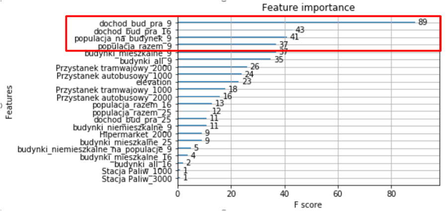

# Data_Analysis_Hackaton

Simulation of air pollution changes in Cracow depending on various urbanistic factors. Project honoured with a distinction award on Warsaw 2018 Data Analysis 24h Marathon.

Data taken from:
Air pollution sensors and measurements:
https://developer.airly.eu/

Demographic information and Cracow:
http://www.datawise.pl/
http://api.locit.pl/docs/

Elevation: - Open Elevation API
https://open-elevation.com/

Technology used: Python (numpy, pandas, matplotlib, seaborn, scikit-learn, xgboost), Jupyter Notebooks, PostgreSQL

Sensors locations with grid

Sensors measurements

Feature importance

Simulation results

